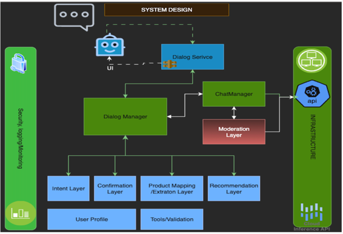

# Project Name : GenAI - AI Shop Assist case study

## Table of Contents
* [General Info](#general-information)
* [System Design](#system-architecture)
* [Steps](#steps)
* [Technologies Used](#technologies-used)
* [Conclusions](#conclusions)
* [Acknowledgements](#acknowledgements)
## General Information
> Our project aims to build a chat boat. Online shopping has become the go-to option for many consumers.
However, the overwhelming number of choices and the lack of personalized assistance can make the shopping
experience daunting. To address this, we have developed **ShopAssist AI, a chatbot that combines the power of
large language models and rule-based functions to ensure accurate and reliable information delivery**.
## System Architecture

## Steps
- ### 📦 Prerequisites
    Before running the app, make sure you have:
    - Docker installed
    - VS Code or PyCharm or Cursor
- ### 🚀 Running the App
  - 1️⃣ Clone the repository
    - git clone https://github.com/niranjantitan76/GenAI-ShopAssist_2.git
    - cd GenAI-ShopAssist_2
  - 2️⃣ Build and start the container
    - docker-compose up --build
    - use : http://127.0.0.1:7860/gradio/
## Technologies Used
- python = ">=3.9,<4.0"
- fastapi = "^0.111.0"
- uvicorn = "^0.30.0"
- "pandas",
- "fastapi",
- "uvicorn[standard]",
- "sqlalchemy",
- "pydantic",
- "alembic",
- "python-dotenv",
- "gradio",
- "tenacity",
- "openai",
- "pydantic",
- "httpx",
- "fastapi",
- "IPython",
- "logging",
- "os",
- "redis"

## Acknowledgements
- I would like to express gratitude to the UpGrad and IIITB Programme for providing me with the opportunity to implement GenAI as part of our coursework.

## Contact
Created by [@niranjantitan]

## License
This project is open source and available without restrictions.
